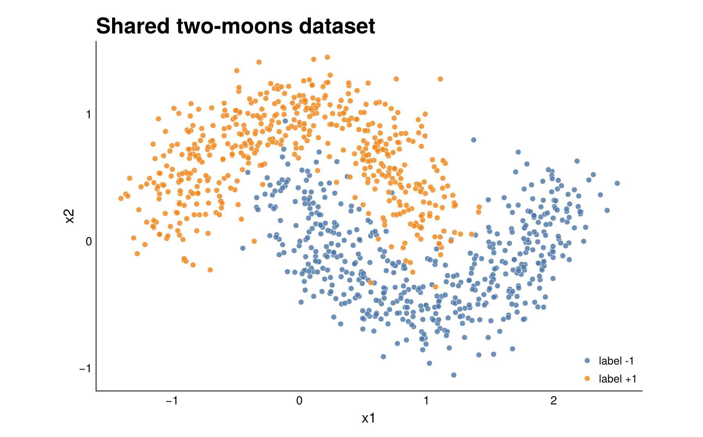
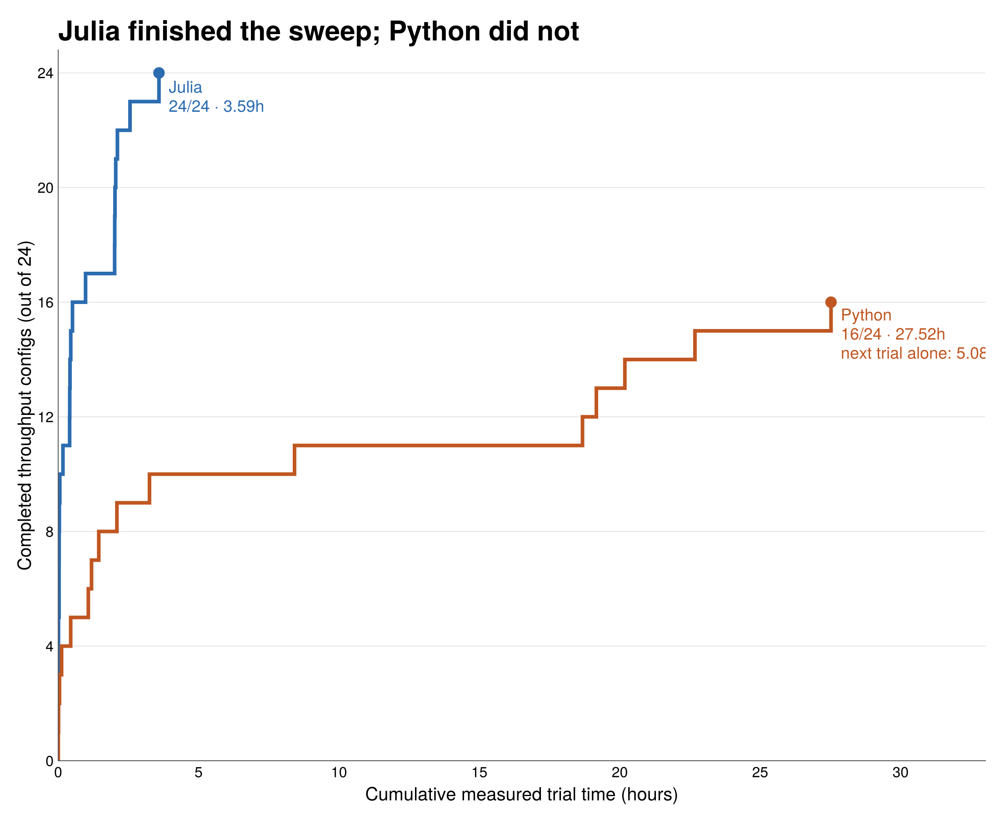
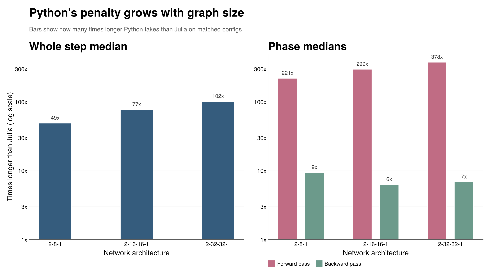
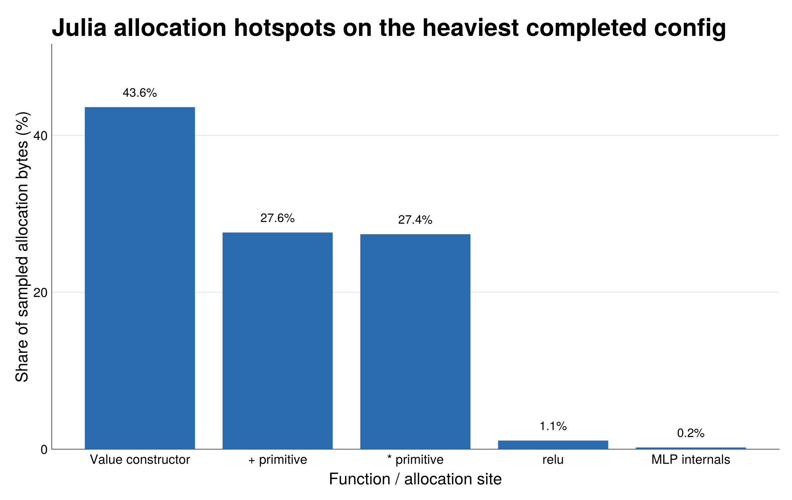

# Micrograd.jl

A Julia port of [Andrej Karpathy's micrograd](https://github.com/karpathy/micrograd): scalar-valued autodiff, a tiny MLP stack, and a benchmark harness that compares the Julia and pure-Python versions on the same workload.

The core engine is plain Julia scalar code. The experiment harness under `examples/` uses shared datasets, shared weights, and matching training settings so the comparison stays focused on host-language/runtime overhead.

## Features

- `Value` type with full scalar arithmetic: `+`, `-`, `*`, `/`, `^`, `inv`
- Activation functions: `tanh`, `relu`
- Autodiff via `backward!` with topological sort and gradient accumulation
- `Neuron`, `Layer`, and `MLP` stack for small scalar networks
- Passes Karpathy's reference test suite (verified against PyTorch)
- Tuple-based parent storage and named backward closures for a cleaner, lower-overhead engine

## Usage

```julia
using Micrograd

a = Value(2.0)
b = Value(3.0)
c = a * b + a^2
backward!(c)

a.grad  # dc/da = b + 2a = 7.0
b.grad  # dc/db = a = 2.0
```

## Quick start

Instantiate the Julia environments:

```sh
julia --project=. -e 'using Pkg; Pkg.instantiate()'
julia --project=examples -e 'using Pkg; Pkg.resolve(); Pkg.instantiate()'
```

Set up the Python benchmark environment:

```sh
cd examples/karpathy && uv sync
```

Run the test suites:

```sh
julia --project=. -e 'using Pkg; Pkg.test()'
cd examples/karpathy && uv run python -m unittest test_engine.py test_nn.py
```

## Benchmark

This benchmark is intentionally host-language-dominated: same scalar autograd, same full-batch training loop, no NumPy/BLAS/CUDA/Flux/PyTorch/sklearn in the hot path.

Matched controls:

- same shared JSON two-moons datasets in both languages
- same shared JSON initial weights in both languages
- same architectures, activations, loss choices, and learning-rate schedule
- same full-batch gradient descent loop in both languages
- iterative topological traversal in both languages after the recursive topo walk hit Python recursion limits
- Julia and Python sweeps run sequentially on the same machine to avoid cross-process contention



| Metric | Result |
| --- | --- |
| Julia throughput sweep | `24/24` configs in `12922.56s` (`3.59h`) |
| Python throughput sweep | truncated at `16/24` configs after `99084.98s` (`27.52h`) |
| Interrupted next Python trial | `[2,32,32,1]`, `n=5000`: `18282.88s` (`5.08h`) for trial `1/5` |
| Matched configs | `16` |
| Median slowdown | `70.3x` |
| Slowdown range | `30.4x–130.3x` |
| Architecture medians | `[2,8,1]`: `49.2x`; `[2,16,16,1]`: `77.4x`; `[2,32,32,1]`: `102.0x` |



Julia finished the full throughput sweep on one Apple Silicon machine in `3.59h` of measured trial time. Python had already spent `27.52h` on only `16` throughput configs, and the next Python trial alone was already at `5.08h` when the run was stopped.



The overall slowdown is already large on the smallest network, but the forward pass is where the gap really blows out. Across the matched configs, architecture medians rise from `49.2x` to `102.0x`, while forward-pass medians rise from `221x` to `378x`.

### Representative points

| Config | Julia median | Python median | Slowdown | Note |
| --- | ---: | ---: | ---: | --- |
| `[2,8,1]`, `n=10000` | `14.86s` | `452.17s` | `30.4x` | smallest matched gap |
| `[2,16,16,1]`, `n=10000` | `170.38s` | `7356.79s` | `43.2x` | same scalar loop, much larger wall-clock |
| `[2,32,32,1]`, `n=1000` | `44.09s` | `3439.55s` | `78.0x` | larger graph, much steeper penalty |
| `[2,32,32,1]`, `n=5000` | `336.41s` | `18282.88s` | `54.3x` | single Python trial only, then truncated |

This is a CPU benchmark where the hot path stays in the host language by design. It says something useful about local scalar training loops and experiment budget; it does not say that Julia beats optimized MLX/CUDA/PyTorch transformer stacks end to end.

<details>
<summary>Matched inputs and training settings</summary>

- **Generator**: `examples/data/datasets.py`
- **Shared data**: `examples/data/moons_*.json`
- **Sizes**: 100, 200, 500, 1000, 5000, 10000 samples
- **Defaults**: `seed=17`, `noise=0.2`
- **Python training loop**: `examples/karpathy/train.py`
- **Julia training loop**: `examples/jeggs/train.jl`
- **Loss**: hinge (max-margin) + L2 regularization, full-batch gradient descent
- **LR schedule**: `lr = 1.0 - 0.9 * k / n_steps`
- **Architectures**: `[2,8,1]`, `[2,16,16,1]`, `[2,32,32,1]`, `[2,16,32,16,1]`

Weights are generated once in Python (`examples/weights/weights.py`) and saved as JSON, then loaded in both languages. That removes initialization RNG differences and keeps both runs on the same starting point.

Regenerate the shared datasets with:

```sh
cd examples/karpathy && uv run python ../data/datasets.py
```
</details>

<details>
<summary>Scalar graph primitive appendix</summary>

One follow-up was to count how much scalar graph work each implementation builds on a single matched config: `n=200`, `arch=[2,16,16,1]`, `steps=100`, `activation=relu`, `loss=hinge`.

Both counters walk the computation graph from `total_loss` on every step and count non-leaf operation nodes separately from leaf nodes.

| Language | Total graph nodes | Operation nodes | Benchmark median | Effective operation nodes/s |
| --- | ---: | ---: | ---: | ---: |
| Julia | `14,401,600` | `13,627,700` | `1.43s` | `9.56M/s` |
| Python | `13,061,800` | `12,947,700` | `185.69s` | `69.7k/s` |

Scripts:

- `examples/jeggs/count_graph_ops.jl`
- `examples/karpathy/count_graph_ops.py`
</details>

<details>
<summary>Allocation profile snapshot</summary>

For the heaviest completed Julia config (`n=10000`, `arch=[2,32,32,1]`, `steps=100`, `relu`, `hinge`):

- benchmark instrumentation recorded about `2.76 GB/step` in the forward pass and `2.37 GB/step` in the backward pass
- the sampled allocation profile points mainly at `Value` construction and the `+` / `*` primitive sites in `src/engine.jl`


</details>

<details>
<summary>Topological traversal note</summary>

The original benchmark fork started from recursive topological traversal in both languages because that matched the teaching implementation. Julia completed the recursive pass, but Python failed at `n=1000`, `arch=[2,8,1]`, `steps=100` with `RecursionError: maximum recursion depth exceeded`.

Both benchmark forks now use iterative DFS-based topological traversal. The gradients and traversal order stay the same; the change only removes recursion-depth artifacts from the larger full-batch graphs.
</details>

## Running benchmarks manually

Run the full local benchmark pipeline:

```sh
./examples/run_benchmarks.sh
```

Or run the Julia and Python sweeps separately:

```sh
julia --project=examples examples/jeggs/bench.jl
cd examples/karpathy && uv run python bench.py
```

Both scripts write raw trial data to `examples/results/`. The default loss is `hinge`; switch to binary cross-entropy with `--loss cross_entropy`.

## Plotting results

```sh
julia --project=examples examples/plot_results.jl
julia --project=examples examples/plot_moons_dataset.jl
```

The plotting scripts read `examples/results/bench_*.json` and write the tracked README figures under `docs/figures/`.

## Julia allocation profiling

After a Julia benchmark run, use the allocation profiler to zoom in on the allocation-heavy phase. By default it reads `examples/results/bench_julia.json`, picks the configuration with the highest benchmark bytes per step, chooses the phase with the highest bytes per step inside that config, and writes a ranked sampled-allocation report under `examples/results/allocation_profiles/`.

```sh
julia --project=examples examples/jeggs/profile_allocations.jl
```

To profile a specific configuration instead:

```sh
julia --project=examples examples/jeggs/profile_allocations.jl --n-samples 1000 --arch 16,16,1 --activation relu --loss hinge --phase forward
```
